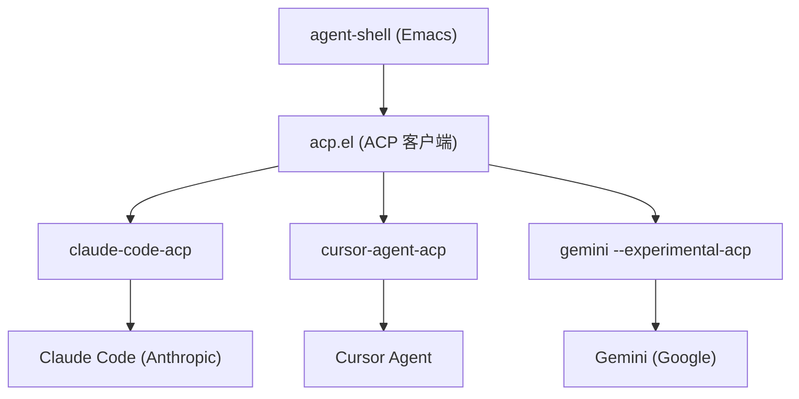
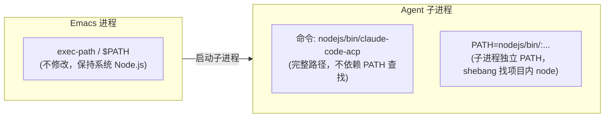

# Agent Shell + ACP 集成计划

## 背景

[agent-shell](https://github.com/xenodium/agent-shell) 是基于 ACP（Agent Client Protocol）的 Emacs 原生 Shell，由 Zed 和 Google 联合开发的代理协议驱动，类似 LSP 但面向 AI 代理。它基于 `comint-mode` 提供统一的交互界面。




### 核心约束：系统 PATH 中有其他 Node.js

系统 `$PATH` 中已有其他版本的 Node.js，**不能**将项目内置的 `nodejs/bin/` 加到全局 `exec-path` 或 `$PATH` 中，否则会影响 Emacs 中其他依赖 Node.js 的功能。

**解决方案：通过 agent-shell 的命令配置变量直接指定完整路径**

agent-shell 为每个代理提供了两个关键配置变量（以 Claude 为例）：

- `agent-shell-anthropic-claude-command` -- 命令及参数列表，如 `'("/full/path/claude-code-acp")`
- `agent-shell-anthropic-claude-environment` -- 子进程的环境变量列表

从源码确认，agent-shell 内部这样使用这些变量：

```elisp
;; agent-shell-anthropic.el 中的关键代码：
(agent-shell--make-acp-client
  :command (car agent-shell-anthropic-claude-command)        ; 取列表第一个元素作为命令
  :command-params (cdr agent-shell-anthropic-claude-command)  ; 其余元素作为参数
  :environment-variables (append env-vars-overrides
                                agent-shell-anthropic-claude-environment)
  :context-buffer buffer)
```

因此策略是：

1. `*-command` 使用完整路径，直接指向 `nodejs/bin/` 下的二进制文件
2. `*-environment` 为子进程设置 `PATH`，让 `#!/usr/bin/env node` shebang 找到项目内的 `node`




## Step 1：创建 `setup-agents.sh` 安装脚本

参考 [setup-lsp.sh](setup-lsp.sh) 的风格，创建 `setup-agents.sh`。

脚本逻辑：

1. 检查 `nodejs/bin/node` 和 `nodejs/bin/npm` 是否存在（不存在则提示先运行 `setup-lsp.sh`）
2. 使用 `nodejs/bin/npm install -g` 安装三个 ACP 适配器
3. 验证每个二进制文件是否存在于 `nodejs/bin/`
4. 打印安装摘要和后续操作指引

安装的 npm 包及对应二进制名：

- `@zed-industries/claude-code-acp` -> `nodejs/bin/claude-code-acp`
- `@blowmage/cursor-agent-acp` -> `nodejs/bin/cursor-agent-acp`
- `@google/gemini-cli` -> `nodejs/bin/gemini`

脚本核心结构（完整复用 setup-lsp.sh 的颜色定义和工具函数）：

```bash
#!/usr/bin/env bash
# setup-agents.sh — 一键安装 ACP 代理适配器
set -euo pipefail

EMACS_DIR="$(cd "$(dirname "$0")" && pwd)"
NODE_DIR="${EMACS_DIR}/nodejs"

# （复用 setup-lsp.sh 的颜色和工具函数）

setup_agents() {
    if [[ ! -x "${NODE_DIR}/bin/node" ]]; then
        error "未找到内置 Node.js，请先运行: bash setup-lsp.sh"
    fi

    info "安装 ACP 代理适配器..."
    "${NODE_DIR}/bin/node" "${NODE_DIR}/bin/npm" install -g \
        @zed-industries/claude-code-acp \
        @blowmage/cursor-agent-acp \
        @google/gemini-cli

    # 逐个验证
    for cmd in claude-code-acp cursor-agent-acp gemini; do
        if [[ -x "${NODE_DIR}/bin/${cmd}" ]]; then
            ok "${cmd} 安装成功"
        else
            warn "${cmd} 未找到于 ${NODE_DIR}/bin/"
        fi
    done
}
```

用法：

```bash
cd ~/.emacs.d && bash setup-agents.sh
```

## Step 2：在 `core/core-keybindings.el` 添加 `C-j a` 前缀键

在 [core/core-keybindings.el](core/core-keybindings.el) 第 52 行（终端前缀 `C-j v` 之后）添加：

```elisp
;; C-j a -- AI Agent (agent-shell)
(define-prefix-command 'skemacs-agent-prefix)
(global-set-key (kbd "C-j a") 'skemacs-agent-prefix)
```

## Step 3：创建模块 `modules/init-agent-shell.el`

参考 [modules/init-git.el](modules/init-git.el) 模板，创建完整模块。

### 3.1 定义路径常量

```elisp
(defvar skemacs--node-bin
  (expand-file-name "nodejs/bin" user-emacs-directory)
  "项目内置 Node.js 的 bin 目录路径。")
```

### 3.2 构建子进程 PATH 环境变量

为 ACP 代理子进程构建独立的 `PATH`，将项目内 `nodejs/bin/` 放在最前面，确保 `#!/usr/bin/env node` 找到项目内的 node 而非系统的：

```elisp
(defvar skemacs--agent-path
  (concat skemacs--node-bin ":" (getenv "PATH"))
  "ACP 代理子进程使用的 PATH 环境变量。
将项目内 nodejs/bin/ 置于最前，确保 shebang 找到正确的 node。")
```

### 3.3 use-package 声明 + 命令路径配置

```elisp
(use-package agent-shell
  :ensure t
  :defer t
  :bind
  (("C-j a a" . agent-shell)                            ; 启动/复用任意 Agent
   ("C-j a c" . agent-shell-anthropic-start-claude-code) ; Claude Code
   ("C-j a u" . agent-shell-cursor-start-agent)          ; Cursor Agent
   ("C-j a g" . agent-shell-google-start-gemini)         ; Gemini CLI
   ("C-j a n" . agent-shell-new-shell)                   ; 新建 Agent Shell
   ("C-j a i" . agent-shell-insert-file))                ; 插入文件作为上下文
  :init
  ;; which-key 描述
  (with-eval-after-load 'which-key
    (which-key-add-key-based-replacements
      "C-j a"   "AI Agent"
      "C-j a a" "Agent shell"
      "C-j a c" "Claude Code"
      "C-j a u" "Cursor Agent"
      "C-j a g" "Gemini CLI"
      "C-j a n" "New shell"
      "C-j a i" "Insert file"))
  :config
  ;; ── 命令路径：直接指向项目内 nodejs/bin/ 下的二进制 ──
  (setq agent-shell-anthropic-claude-command
        (list (expand-file-name "claude-code-acp" skemacs--node-bin)))

  (setq agent-shell-cursor-command
        (list (expand-file-name "cursor-agent-acp" skemacs--node-bin)))

  (setq agent-shell-google-gemini-command
        (list (expand-file-name "gemini" skemacs--node-bin)
              "--experimental-acp"))

  ;; ── 子进程环境变量：独立 PATH 指向项目内 node ──
  ;; 确保 ACP 适配器脚本的 #!/usr/bin/env node 找到项目内的 node
  (setq agent-shell-anthropic-claude-environment
        (agent-shell-make-environment-variables
         "PATH" skemacs--agent-path))

  (setq agent-shell-cursor-environment
        (agent-shell-make-environment-variables
         "PATH" skemacs--agent-path))

  (setq agent-shell-google-gemini-environment
        (agent-shell-make-environment-variables
         "PATH" skemacs--agent-path))

  ;; ── 认证配置 ──
  ;; Claude Code: 登录式 OAuth（首次使用时打开浏览器）
  (setq agent-shell-anthropic-authentication
        (agent-shell-anthropic-make-authentication :login t))

  ;; Gemini CLI: 登录式 OAuth
  (setq agent-shell-google-authentication
        (agent-shell-google-make-authentication :login t)))
```

### 3.4 路径解析流程

以 Claude Code 为例，agent-shell 启动代理时的解析过程：

```
agent-shell-anthropic-claude-command = '("/Users/.../nodejs/bin/claude-code-acp")
                                         ↓
(car ...) = "/Users/.../nodejs/bin/claude-code-acp"   → :command（完整路径，不走 PATH 查找）
(cdr ...) = nil                                        → :command-params（无额外参数）

agent-shell-anthropic-claude-environment = '("PATH=/Users/.../nodejs/bin:/usr/bin:...")
                                         ↓
子进程 PATH 以 nodejs/bin/ 开头 → #!/usr/bin/env node 找到项目内的 node v22.14.0
```

### 3.5 快捷键汇总

- `C-j a a` -- 启动/复用任意 Agent（弹出选择菜单）
- `C-j a c` -- 启动 Claude Code
- `C-j a u` -- 启动 Cursor Agent
- `C-j a g` -- 启动 Gemini CLI
- `C-j a n` -- 新建 Agent Shell（`C-u C-j a a` 也可以）
- `C-j a i` -- 插入文件作为上下文

Shell 内置操作：

- `RET` -- 发送提示词
- `M-J` -- 插入换行
- `C-c C-c` -- 中断当前操作
- `TAB / S-TAB` -- 在交互元素间导航

## 变更文件清单

- `setup-agents.sh` -- **新建** -- ACP 适配器安装脚本（约 80 行）
- `core/core-keybindings.el` -- 添加 `C-j a` 前缀键定义（+3 行）
- `modules/init-agent-shell.el` -- **新建** -- agent-shell 模块（约 75 行）

## 认证说明

各代理需要在首次使用前完成认证：

- **Claude Code** -- 登录式 OAuth（首次启动 agent shell 时自动打开浏览器）；或在 `:config` 中改用 `:api-key` 方式并通过 environment 传入 `ANTHROPIC_API_KEY`
- **Cursor Agent** -- 需要先在终端执行 `cursor-agent login` 完成认证
- **Gemini CLI** -- 登录式 OAuth（首次启动时自动打开浏览器）；或改用 `:api-key` 方式并通过 environment 传入 `GEMINI_API_KEY`

## 备注

- 模块通过 Skemacs 自动扫描加载，无需修改 `init.el`
- 使用 `:defer t` + `:bind` 延迟加载，对启动速度零影响
- **不修改全局 `exec-path` 和 `$PATH**`，不会影响系统中其他 Node.js 的使用
- `nodejs/` 已在 `.gitignore` 中，ACP 适配器随之被忽略，无需额外修改 `.gitignore`
- 后续更新适配器：`cd ~/.emacs.d && nodejs/bin/node nodejs/bin/npm update -g @zed-industries/claude-code-acp @blowmage/cursor-agent-acp @google/gemini-cli`

