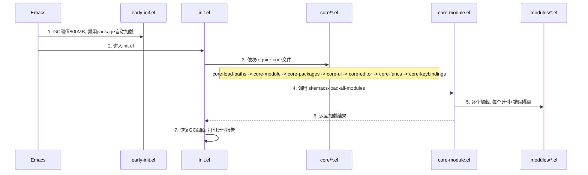

# 从零搭建 Emacs 配置项目

## 目录结构

```
~/Documents/ChanningKuo/emacs.d/
├── early-init.el            # GC 优化 + 原生编译 + 禁用 package.el 自动加载
├── init.el                  # 启动入口（按顺序加载 core，再加载 modules）
├── core/                    # 核心基础设施（不依赖第三方包）
│   ├── core-load-paths.el   # 路径常量 + load-path 设置
│   ├── core-module.el       # 模块加载系统（计时 + 错误隔离 + 启用/禁用）
│   ├── core-packages.el     # use-package + package.el 配置
│   ├── core-ui.el           # 基础 UI（toolbar/menubar/scrollbar 等）
│   ├── core-editor.el       # 编辑行为（括号匹配、选择替换、折叠等）
│   ├── core-funcs.el        # 工具函数（导航、窗口、剪贴板）
│   └── core-keybindings.el  # 全局快捷键（不依赖任何包的绑定）
├── modules/                 # 功能模块（每个文件完全自包含）
│   └── (后续逐步添加)
├── local/                   # 本地自定义配置（可选，不纳入 Git）
└── custom.el                # Emacs custom-file（自动生成，不纳入 Git）
```

## 设计原则

- **core/ 按显式顺序加载**：在 init.el 中逐个 `require`，顺序清晰可控
- **modules/ 由模块系统管理**：自动扫描 + 可禁用 + 错误隔离 + 计时
- **每个模块完全自包含**：包声明 + 配置 + 快捷键都在同一个文件内
- `**use-package :bind**` 管理快捷键：所有自定义绑定通过 `describe-personal-keybindings` 一键查看
- **快捷键前缀集中定义**：在 `core-keybindings.el` 中定义前缀键（`C-j`、`C-x w` 等），模块往前缀下绑定

---

## 启动流程




---

## 核心文件设计

### 1. `early-init.el`

Emacs 27+ 在 init.el 之前、GUI 初始化之前加载此文件。

```elisp
;; GC 优化：启动期间提高阈值，减少 GC 暂停
(setq gc-cons-threshold (* 800 1024 1024))
(setq gc-cons-percentage 0.6)
;; 禁止 package.el 在 init.el 前自动加载已安装的包
(setq package-enable-at-startup nil)
;; 原生编译优化（Emacs 28+）
(when (featurep 'native-compile)
  (setq native-comp-async-report-warnings-errors nil)
  (setq native-comp-deferred-compilation t))
;; 禁止在启动时调整 frame 大小（加速启动）
(setq frame-inhibit-implied-resize t)
```

### 2. `core/core-module.el` — 核心创新

模块加载系统，提供：

- `**skemacs-module-list**`：已启用模块列表（用户可配置）。设为 `nil` 表示自动加载 `modules/` 下所有文件
- `**skemacs-disabled-modules**`：禁用模块列表（优先级高于自动扫描）
- `**skemacs-load-times**`：收集 `((文件名 . 耗时秒数) ...)` 的 alist
- `**skemacs-module-errors**`：收集 `((文件名 . 错误信息) ...)` 的 alist
- `**skemacs-load-module**`：加载单个模块，`condition-case` 包裹，记录耗时
- `**skemacs-load-all-modules**`：扫描 modules/ 目录或遍历 module-list，逐个调用 load-module
- `**skemacs/show-load-times**`：交互命令，弹出格式化的计时报告 buffer

计时报告输出示例（启动后自动打印到 `*Messages*`，也可 `M-x skemacs/show-load-times` 查看）：

```
╔══════════════════════════════════════════════════════════╗
║              Emacs Startup Timing Report                ║
╠══════════════════════════════════════════════════════════╣
║ Module                         Time        Status       ║
╠══════════════════════════════════════════════════════════╣
║ core-load-paths                0.001s      OK           ║
║ core-module                    0.001s      OK           ║
║ core-packages                  0.234s      OK           ║
║ core-ui                        0.002s      OK           ║
║ core-editor                    0.001s      OK           ║
║ core-funcs                     0.001s      OK           ║
║ core-keybindings               0.001s      OK           ║
╠══════════════════════════════════════════════════════════╣
║ init-which-key                 0.045s      OK           ║
║ init-theme                     0.012s      OK           ║
╠══════════════════════════════════════════════════════════╣
║ Total: 0.298s | 9 loaded | 0 disabled | 0 errors       ║
╚══════════════════════════════════════════════════════════╝
```

### 3. `init.el` — 启动入口

精简清晰：

```elisp
;; 记录启动时间
(defvar skemacs-start-time (current-time))
;; 加载核心（显式顺序）
(require 'core-load-paths)
(require 'core-module)
(require 'core-packages)
(require 'core-ui)
(require 'core-editor)
(require 'core-funcs)
(require 'core-keybindings)
;; 加载功能模块
(skemacs-load-all-modules)
;; 加载 custom-file
(setq custom-file (expand-file-name "custom.el" user-emacs-directory))
(when (file-exists-p custom-file) (load custom-file nil t))
;; 启动完成：恢复 GC + 打印报告
(add-hook 'emacs-startup-hook
  (lambda ()
    (setq gc-cons-threshold (* 16 1024 1024))
    (skemacs--print-load-report)))
```

### 4. `core/core-keybindings.el` — 前缀键 + 全局绑定

定义所有前缀键，让模块可以独立往其下绑定：

```elisp
;; 前缀键定义
(define-prefix-command 'skemacs-prefix)
(global-set-key (kbd "C-j") 'skemacs-prefix)
(define-prefix-command 'skemacs-org-prefix)
(global-set-key (kbd "C-j o") 'skemacs-org-prefix)
(define-prefix-command 'skemacs-window-prefix)
(global-set-key (kbd "C-x w") 'skemacs-window-prefix)
(define-prefix-command 'skemacs-buffer-prefix)
(global-set-key (kbd "C-x b") 'skemacs-buffer-prefix)

;; 全局绑定（不依赖任何包）
(global-set-key (kbd "M-n") 'skemacs/next-ten-lines)
(global-set-key (kbd "M-p") 'skemacs/previous-ten-lines)
;; ... 其他不依赖包的全局绑定
```

### 5. 其他 core 文件

- `**core-load-paths.el**`：定义 `skemacs-core-dir`、`skemacs-modules-dir`、`skemacs-local-dir` 等路径常量，设置 `load-path`
- `**core-packages.el**`：配置 package-archives（清华镜像 + MELPA）、初始化 use-package、设置代理
- `**core-ui.el**`：从当前 `002-config.el` 迁移 UI 设置（toolbar/menubar/scrollbar/bell 等）
- `**core-editor.el**`：从当前 `002-config.el` 迁移编辑行为（electric-pair/show-paren/delete-selection/hs-minor 等）
- `**core-funcs.el**`：从当前 `001-funcs.el` 迁移工具函数

---

## 模块文件约定

每个模块文件遵循以下模板（后续添加时参照）：

```elisp
;;; init-xxx.el --- 简短描述 -*- lexical-binding: t -*-
;;; Commentary:
;; 详细说明此模块的功能和包含的包。

;;; Code:

(use-package some-package
  :ensure t
  :defer t                              ; 尽量延迟加载
  :hook (some-mode . some-package-mode) ; 或用 :commands
  :bind
  (("C-j x" . some-command)            ; 快捷键定义在模块内
   :map some-mode-map
   ("C-c x" . another-command))
  :init
  ;; which-key 描述（如果已加载 which-key）
  (with-eval-after-load 'which-key
    (which-key-add-key-based-replacements "C-j x" "描述"))
  :config
  (setq some-option t))

(provide 'init-xxx)
;;; init-xxx.el ends here
```

---

## 第一步实现范围

只实现架构骨架，不安装任何第三方包：

- `early-init.el` — GC + 原生编译
- `init.el` — 启动入口
- `core/core-load-paths.el` — 路径
- `core/core-module.el` — 模块加载系统 + 计时报告（核心创新）
- `core/core-packages.el` — use-package 设置
- `core/core-ui.el` — 基础 UI
- `core/core-editor.el` — 编辑行为
- `core/core-funcs.el` — 工具函数
- `core/core-keybindings.el` — 前缀键 + 全局绑定

总计 **9 个文件**，搭好完整骨架。之后可以通过在 `modules/` 下添加文件来逐步迁移现有功能（主题、补全、导航、Git、Org 等）。

---

## 后续迁移路线（按优先级）

1. `init-theme.el` — 主题设置
2. `init-which-key.el` — 按键发现（对后续所有模块有用）
3. `init-completion.el` — Ivy/Counsel/Swiper 补全框架
4. `init-navigation.el` — Avy + Ace-window 导航
5. `init-editing.el` — Multiple-cursors + Undo-tree + Mwim
6. `init-project.el` — Projectile + Dashboard
7. `init-git.el` — Magit
8. `init-lsp.el` — lsp-bridge + Company + YASnippet
9. `init-terminal.el` — Vterm
10. `init-ui.el` — Modeline + Treemacs + Rainbow-delimiters
11. `init-flycheck.el` — 语法检查
12. `init-org.el` — Org-mode 全套配置

